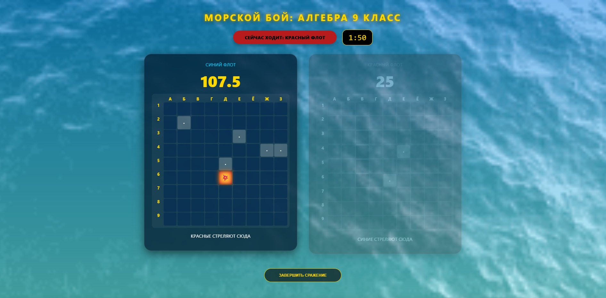

# ⚓ Морской Бой: Алгебра 9 класс

Интерактивная игра для обучения алгебре в 9 классе с элементами морского боя. Игроки решают математические примеры, чтобы выстрелить по кораблям противника.

## 🎮 Описание

Это образовательная игра, которая объединяет классическую игру "Морской бой" с решением алгебраических примеров. Два флота (синий и красный) ведут боевые действия на девятиклеточных полях (9×9). Каждый выстрел требует решения математической задачи.

## 📸 Скриншоты

### Игровое поле



### Модальное окно с вопросом


## 📋 Основные особенности

- **Игровое поле 9×9** с координатами по буквам и цифрам
- **162 алгебраических примера** для решения
- **Два флота** по 5 кораблей каждый:
  - 1 корабль на 5 палуб
  - 1 корабль на 4 палубы
  - 2 корабля по 3 палубы
  - 1 корабль на 2 палубы
- **Система очков**:
  - Правильный ответ: +10 очков
  - Попадание в корабль: +10 очков дополнительно
  - Потопление корабля: +15 бонусных очков
  - Неправильный ответ: -5 очков
- **Таймер хода**: 2 минуты на решение и выстрел
- **Блокировка ошибочных клеток**: 5 минут (с видимым таймером на клетке)
- **Персистентность**: игра сохраняется в памяти браузера

## 🧭 Элементы управления

### Кнопки в модальном окне

- **🧭 ИСПОЛЬЗОВАТЬ КОМПАС** (-5 очков) — показывает варианты ответов
- **🔭 ПОДЗОРНАЯ ТРУБА** (-2.5 очка) — показывает подсказку к примеру
- **ПОКАЗАТЬ ОТВЕТ** — раскрывает правильный ответ (можно вручную оценить его)
- **ПРОВЕРИТЬ ОТВЕТ** — проверяет выбранный вариант из компаса

## 💾 Технологии

- **Frontend**: HTML5, CSS3, JavaScript (ES6+)
- **Персистентность**: localStorage + cookies
- **Загрузка данных**: CSV файл с примерами
- **Медиа**: PNG иконки (компас, подзорная труба), MP3 звуки (выстрел, попадание, потопление)
- **Фон**: Анимированный GIF

## 📁 Структура проекта

```
batlleship/
├── main.html          # Основной HTML файл
├── script.js          # Логика игры (777 строк)
├── style.css          # Стили (456 строк)
├── questions.csv      # База из 162 примеров
├── media/
│   ├── compass.png              # Иконка компаса
│   ├── подзорная_труба.png      # Иконка подсказки
│   ├── new_back.gif             # Анимированный фон
│   ├── попадание.png            # Изображение попадания
│   ├── попадание2.png           # Альтернативное попадание
│   ├── мимо.png                 # Изображение промаха
│   ├── тонет.jpg                # Изображение потопления
│   ├── воду.mp3                 # Звук выстрела
│   ├── попадание.mp3            # Звук попадания
│   └── крушение.mp3             # Звук потопления
├── README.md          # Этот файл
└── LICENSE            # Лицензия

```

## 🚀 Как запустить

1. Откройте `main.html` в веб-браузере (Chrome, Firefox, Safari, Edge)
2. Выберите флот (синий или красный)
3. Нажимайте на клетки вражеского поля
4. Решайте примеры и выбирайте правильные ответы
5. Первый, кто потопит все корабли противника, побеждает

## 📊 Система сохранения

Игра автоматически сохраняет состояние в:

- **localStorage** (основное хранилище)
- **Cookies** (резервная копия)

При перезагрузке страницы восстанавливаются:

- Текущие очки обоих флотов
- Использованные вопросы (ID)
- Состояние всех клеток (попадания, промахи, ошибки)
- Заблокированные клетки (с оставшимся временем)
- Активный флот

## ⚙️ CSV формат вопросов

```
id;вопрос;изображение;答え;вариант1;вариант2;вариант3;вариант4;вариант5;подсказка
```

Пример:

```
1;Решите уравнение: 2x + 3 = 7;img.png;2;1;2;3;4;5;Перенесите 3 влево, разделите на 2
```

## 🎨 Дизайн

- **Морская тематика**: иконки (компас, подзорная труба), военно-морской стиль названий
- **Два флота**: синий (#00d2ff) и красный (#ff4b2b) для визуального разделения
- **Анимированный фон**: морской пейзаж
- **Звуковые эффекты**: выстрел, попадание, потопление кораблей

## 📝 Лицензия

See LICENSE file.

## 👨‍💻 Разработка

Создано для обучения 9 класса на основе классической игры "Морской бой" с интеграцией алгебраических примеров.

